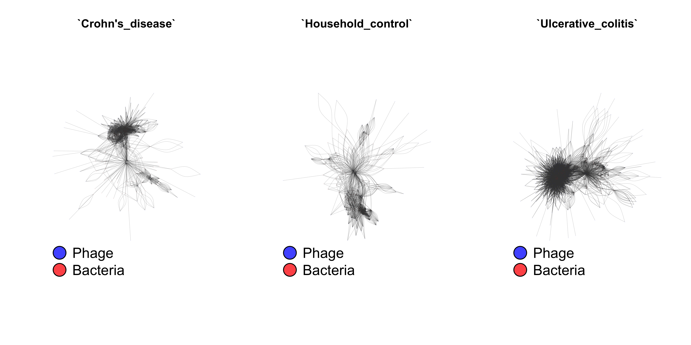

\newpage

# Abstract
Here we present a global view of phage-bacteria interactions across the human virome. We present our model for phage-bacteria interactions with validation for accuracy and sampling coverage. These networks are valuable because they do not rely on the sub-optimal reference genome datasets, and provide a more accurate view of the relationships within the community. We find that interactive dynamics are associated with disease states and anatomical body sites, using a global virome meta-analysis dataset. Our comprehensive approach to understanding the virome provide new insights not only inro composition and diversity, but their context in the greater community. We find that disease states and anatomical sites are not only linked to altered community composition and diversity, but also represent significant shifts in interactive dynamics.

# Introduction
Viruses are obligate parasites whose existence relies on their ability to infect, function and replicate using their host.

Predator-prey interactions are one of the fundamental pillars to an ecosystem's persistence, diversity, and functionality [@Poisot071993;@Thompson:2012ki]. This is particularily evident in the predator-prey dynamics of bacteria and bacteriophage (bacterial virus) communities. Because phages are incapable of their own metabolic processes, they rely on bacteria as reproductive vessels and functional conduits without which they cannot act or persist. Although bacteria are metabolically capable, their evolution and community stability depend on bacteriophage predation and transduction (phage mediated gene transfer). Together these communities are capable of stable persistence in a mutually beneficial relationship.

Despite the mutual dependence of phage and bacteria communities, they are often studied in isolation. This is especially true for the human virome and microbiome. The majority of microbiome studies to date have focused exclusively on bacterial community composition and diversity, largely due to technical limitations. Some studies of the human virome have analyzed the bacterial communities in parallel, but often using cursory techniques. Here we present the use network analyses across a global human virome dataset to understand the ecological network signatures associated with disease states.

By understanding the signatures of the interacting communities, we are able to gain new insights into the biology of these systems. The ecological networks can be used to assess community stability and fragility, and components of that network can be used to assess the specific microbial players in that stability. We also know that these networks can be impacted by environmental factors such as resource availability [@Poisot:2011jc].

Until recently, a global human virome analysis has been largely infeasible. Recent advances in sequencing technology and virus purification techinques have allowed for an influx of paired virome and bacterial metagenomic data that have begun to power meta-analysis capabilities.

# Results
## The Global Human Virome Dataset
We leveraged the extensive public sequence archives to assemble a **global human virome** dataset; a robust human virus community metagenomic dataset that spans diverse body site environments. Dataset sampling includes the gut, oral cavity, skin, and urinary tract systems, all of which are associated with healthy and disease states, and were all collected by multiple, independent groups. By working only with virome datasets that were purified for virus like particles (VLPs), we are able to establish confiendence that we are detecting the *active* virome component. The resulting dataset contains data from ten prominant virus metagenomic studies [@Norman:2015kb;@Monaco:2016it;@Minot:2011ez;@Hannigan:2015fz;@Modi:2013fi;@Ly:2014ew;@Abeles:2015dy;@Reyes:2010cw;@SantiagoRodriguez:2015gd;@Lim:2015bq].

The GHV raw sequences were quality filtered according to our high threshold and  assembled into contigs that represent either complete viral genomes or genomic fragments. We assembled approximately 30,000 contigs whose sequencing depth ranged from ten to over ten thousand sequences **(Figure \ref{ContigStats})**. Contigs were tens of thousands of base pairs long. A large subset of contigs assembled as complete circles, suggesting complete coverage of a subset of viral genome sequences.

## Modeling Phage-Bacteria Interactions Across the Human Virome
We used Neo4J graph database software to construct a network of predicted interactions between bacteria and bacteriophages. Results from a variety of complementary interaction prediction approaches were layered into a single network. *In vitro*, experimentally validated interactive relationships were taken from the existing literature. Clustered Regularly Inter-spaced Short Palindromic Repeats (CRISPRs) are a sort of bacterial adaptive immune system that serves as a genomic record of phage infections by preserving genomic content from the infectious phage genome. These records were used to predict infectious relationships between bacteria and phages. Infectious relationships were also predicted by identifying expected protein-protein interactions and known interacting protein domains between phages and their bacterial hosts. We finally used nucleotide blast to identify genomic similarity between bacteriophage genomes and sections of bacterial genomes. Such a match is a good predictor of an interaction between the phage and it's bacterial host.

We began by working in a controled data environment in which the interactions and lack of interactions had been experimentally validated. This dataset was extracted from manuscripts published between 1992 and 2015 [@Jensen:1998vh;@Malki:2015tm;@Schwarzer:2012ez;@Kim:2012dh;@Matsuzaki:1992gw;@Edwards:2015iz]. It is important to note the strength of our approach in that we used data of confirmed non-interactions as well as confirmed interactions. Previous approached have claimed to perform tests of sensitivity and specificity, but assumed a lack of empirical evidence denoted a lack of interactions, which we know to be untrue. Our approach circumvents this problematic assumption.

We used four predictive score categories of the controlled dataset with a tuned random forest model to classify each sample as an interaction or lack of interaction. The model was validated using repeated k-fold cross validation with k = 5 and ten repetitions. The model was optimized using the receiver operating characteristic (ROC) algorithm for the higher area under the curve (AUC) as implemented in R {caret}. The resulting model exhibited an AUC of 0.853, a sensitivity of 0.851, and a specificity of 0.774 **(Figure \ref{RocCurve})**. These parameters describe only the interactions that were scored. Those that did not have scores were classified as having no interaction prior to predictive modeling. The most important predictor in the model was nucleotide similarity between genes, followed by nucleotide similarity of whole genomes. Protein family (Pfam) interactions were moderately important to the model, while CRISPRs were minimally important. The minimal importance of CRISPRs was primarily due to the low frequency of CRISPR matches to phages compared to the other parameters used.

Although we have assembled some complete genomes as contigs, the majority of the contigs represent genomic fragments that may originate from the same genome while without sharing nucleotide sequence similarity. K-mer spectrum analyses have been increasingly utilized in recent years as researchers attempt to classify the unknown components of microbial metagenomes. For this study we built our own k-mer spectrum analysis workflow so that we can maintain the most control over the approach as possible. Similarities between genomes/contigs was calculated using the Bray-Curtis dissimilarity metric (perhaps try other metrics here). To account for genomes in different directions, or contigs with inverted regions, our k-mer spectra were calculated as a composite of k-mers in both forward and reverse. Because dissimilarity metrics like Bray-Curtis are sensitive to uneven sampling, the distances are based on equal sampling depths that were normalized by subsampling the contig with the greater number of k-mers down to an equal amount. When considering this approach as a clustering algorith, it is analogous to the de novo OTU clustering approach used in 16S rRNA gene analysis2. The processing was made to run in parallel so as to maximize efficiency.

We began by confirming that k-mer spectra provided informative clustering that accurately reflects known biological properties. To acocmplish this, we collected all of the known bacteriophage reference genomes and classified them by their defined bacterial host. We tested the significance of host classification using an analysis of similarity (ANOSIM) which tests that the composition of kmers within a host class is significantly different from the other sample classes. Using this method, we confirmed that kmer spectra do provide highly significant clustering by bacteriophage host **(p-value=0.001, R=0.6677, Figure \ref{refordination} A)**. ANOSIM is based on ranked dissimilarity values from the distance matrix. Comparing the distribution of the dissimilarity ranks reveals that some phage taxa are better resolved by kmer spectrum analysis **(Figure \ref{refordination} B)**. Those phage classes with the least ranked dissimilarities are the best resolved phages, and those at or above the median rank between samples were less well resolved. While Bacillus and Vibrio phages had divergent kmer spectra, Propionibacterium and Streptococcus phages were highly conserved.

As mentioned above, the unique utility of a k-mer spectrum analysis is not in its ability to align, but rather in its ability to infer functional and genomic similarities between biologically related but sequenctially dissimilar genomes. To confirm this benefit over an alignment approach, we assessed the ability of a k-mer spectrum and alignment algoorithm to pair the first and second half of reference genomes. In other words, given the first half of a genome, how accurately can the algorithm identify the matching second half of the genome. We found that alignment performs very poorly at this task and only accurately pairs approximately 20% of the genomes, while the k-mer spectrum algorithm accurately pairs approximately 70% **(Figure \ref{ComparisonBarGraph})**. From this we conclude that k-mer spectrum analyses are able to link genome fragments almost four times more accurately than alignment-based approaches. Together with our biological clustering described above, the data suggest that k-mer spectra do in fact correlate with biological linkages, even when the nucleic acids diverge. This is beneficial when linking contigs (genome fragments) that may have minimal nucleotide similarity despite being biologically linked.

## Interactive Dynamics Are Associated with Anatomical Sites
Phages are known to transfer genetic content between bacteria in the process of transduction. This has great medical importance when considering transduction of antibiotic resistance genes and other virulence factors. In a dense microbial community, transduction is likely to play an important role in bacterial fitness and virulence. To date, we have a minimal understanding of the interactions phages are facilitating between bacteria. Furthermore, the roles of broadly infecting phages have yet to be considered. Our graph approach allows us to begin predicting and understanding these interactions.

We predicted the phage-mediated relationships between bacteria by executing triadic closures as (bacteria)-[phage]->[bacteria]. Triadic closure theory states that a strong relationship of two entities to a shared intermediate suggests a relationship between the two previously unrelated entities. In our case, we are assigning relationships between bacteria based on shared strong relationships to a phage intermediate.

One of the most powerful aspects of this analysis is that it allows us to evaluate the global interactive properties of the interactive networks across the body and thus provide insight into the complex ecological dynamics. We found that the phage-bacteria interactive network follows a scale-free distribution instead of a random exponential distribution. Not only does this indicate a lack of randomness in the population, it also suggests the hub is composed of hubs that are highly interconnected to the remaining nodes.

## Disease States Drive Altered Interactive Network Dynamics
The virome has been associated with a variety of disease states across many body sites. Because many of the virome samples within our global virome dataset were associated with diseases, we were able to identify and confirm global virome trends in the human virome. We found that the diversity of disease samples was impacted by the body site. Despite the disease, the body site contributed to the virome diversity signature.

Here I want to get at the fact that at first, given a stable bacterial reference, the interactive dynamics of the networks differ between disease and healthy states.

I can use eccentricity centrality to define the most central microbial nodes of the complex graph.

The diameter of the network is short, suggesting a small-world distribution. Because it follows a scale-free distribution, it is also protected from random attack, but highly susceptible when hub nodes are impacted. I will need to expand on this later.

<!--
- Include general changes in centrality, as well as the specific phages and bacteria assocaited with highest centrality.
- Look at the network both with bacteria from the metagenomes, as well as the reference bacteria. References are valuable because they take the bacterial variability out of the picture.
-->

# Discussion
An application that we alluded to here is a graphical approach to microbiome research in general.

# Materials & Methods

\newpage

# Figures

\newpage

![Random forest model for bacteria - phage interactions. A) ROC curve of the ten iterations used to create the prediction model. B) Density plot of the distribution of sample interaction probability. Groups indicate whether the sample represented an interaction. C) Importance scores associated with the criteria used to create the random forest model. D) Proportions of samples excluded from model learning due to a lack of scoring. The true interaction status of the sample is noted on the x-axis and bars are colored by the proportion of sample excluded (red) and included (grey) in model training. \label{RocCurve}](../figures/rocCurves.pdf)

\newpage

\newpage

\newpage

\newpage

\newpage

\newpage

\newpage
# References
