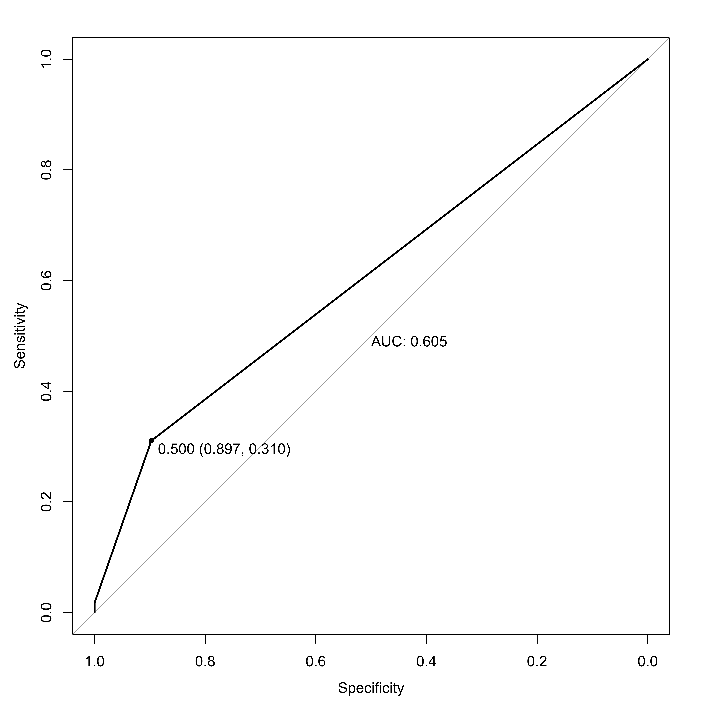

\newpage

# Introduction
The human microbiome is a complex system of interactions, much like social network environments such as Twitter and Facebook.

# Results

### Construction of Bacteria-Phage Interaction Network
We used Neo4J graph database software to construct a network of predicted interactions between bacteria and bacteriophages. Results from a variety of complementary interaction prediction approaches were layered into a single network **(Figure 1)**. *In vitro*, experimentally validated interactive relationships were taken from the existing literature. Clustered Regularly Interspaced Short Palindromic Repeats (CRISPRs) are a sort of bacterial adaptive immune system that serves as a genomic record of phage infections by preserving genomic content from the infectious phage genome. These records were used to predict infectious relationships between bacteria and phages. Infectious relationships were also predicted by identifying expected protien-protien interactions and known interacting protein domains between phages and their bacterial hosts. We finally used nucleotide blast to identify genomic similarity between bacteriophage genomes and sections of bacterial genomes. Such a match is a good predictor of an interaction between the phage and it's bacterial host.

### Network Validation
We validated our predictive graph model by quantifying the sensitivity and specificity using a manually curated dataset of experimentally validated positive and negative interactions. Experimental results were extracted from manuscripts published between 1992 and 2015 **(Figure \ref{BenchmarkHeat})** [@Jensen:1998vh;@Malki:2015tm;@Schwarzer:2012ez;@Kim:2012dh;@Matsuzaki:1992gw;@Edwards:2015iz]. This allowed us to both evaluate the utility of the model, as well as determine the optimal decision thresholds to use for predictions.

The resulting model had an AUC of 0.605, an optimal sensitivity of 0.89, and an associated optimal specificity of 0.310j**(Figure \ref{roccurve})**. These low false positive and low true positive rate mean that our model is unlikely to identify incorrect phage -bacteria interactions, but is also prone to missing existing relationships. Therefore we are confident in the diverse observed interactions while also understanding that we are only observing some of the ongoing interactions.

### Phages Exhibit Diverse and Nested Tropism

### Bacterial Interactions Through Phage Intermediates

Phages are known to transfer genetic content between bacteria in the process of transduction. This has great medical importance when considering transduction of antibiotic resistance genes and other virulence factors. In a dense microbial community, transduction is likely to play an important role in bacterial fitness and virulence. To date, we have a minimal understanding of the interactions phages are facilitating between bacteria. Furthermore, the roles of broadly infecting phages have yet to be considered. Our graph approach allows us to begin predicting and understanding these interactions.

We predicted the phage-mediated relationships between bacteria by executing traidic closures as (bacteria)-[phage]->[bacteria]. Triadic closure theory states that a strong relationship of two entities to a shared intermediate suggests a relationship between the two previously unrelated entities. In our case, we are assigning relationships between bacteria based on shared strong relationships to a phage intermediate.

### Interactive Network Clustering Allows Informative Community Typing

# Methods

\newpage

# Figures

\newpage

\newpage

\newpage
#Bibliography